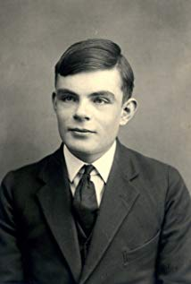
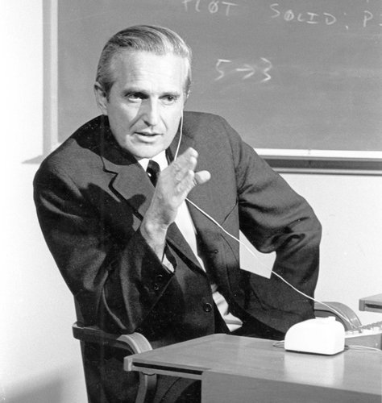

# **Alan Turing**

- **Full Name:** Alan Mathison Turing
- **Date of Birth:** June 23, 1912
- **Date of death:** June 07, 1954
- **Age at death:** 41
- **Main area of research:**  Theoretical Computer Science
- **Two key facts about Alan Turing's personal life:**
  1. He was a homosexual.
  2. he came up with the idea of a machine that was able to compute anything that could be computed.
- **Two key professional contributions:**
  1. He oversaw/inspired the effort to decrypt ciphers from Nazi Germany’s Enigma machine.
  2. He came up with the idea of the universal Turing machine. He envisioned _“one machine for all possible tasks”_- computers as we know them today.
>“Eccentric, solitary, gloomy, vivacious, resigned, angry, eager, dissatisfied — these had always been his ever-varying characteristics,” Hodges wrote, “and despite the strength that he showed the world in coping with outrageous fortune, no one could safely have predicted his future course.”
>
- **Reflective Question:**
  - I would ask Alan Turing how he went about decrypting the enigma machine? I feel such an encryption would be difficult to solve now with modern tools. I cannot imagine the amount of intelligence it would require to do this in the 20th century. I cannot even imagine how one would go about beginning such a project.
- [Obituary](https://www.nytimes.com/2019/06/05/obituaries/alan-turing-overlooked.html)
- [Alan Turing Wikipedia Page](https://en.wikipedia.org/wiki/Alan_Turing)
# **Douglas Engelbart**

- **Full Name:** Douglas Carl Engelbart
- **Date of Birth:** January 30, 1925
- **Date of Death:** July 02, 2013
- **Age at Death:** 88 years old
- **Main area of research:** human-computer interaction
- **Two key facts about Douglas Engelbart's personal life:**
  1.  Enjoyed folk dancing, camping, and hiking
  2. Born in Portland, Oregon
- **Two key professional contributions:**
  1. Engineered the Computer Mouse
  2. Engelbart created _hypertext_ as well as other Desktop interfaces
> "Dr. Engelbart was one of the first to realize the accelerating power of computers and the impact they would have on society. In a presentation at a conference in Philadelphia in February 1960, he described the industrial process of continually shrinking the size of computer circuits that would later be referred to as “Moore’s Law,” after the Intel co-founder Gordon Moore."
- **Reflective Question:**
How did Engelbart come up with the idea for a mouse? why not _any other_ shape, controller, or other such device? it has become so common that nearly everyone has a mouse. I also wonder if Engelbart was the one who named it the mouse? :mouse:
- [link to Obituary](https://www.nytimes.com/2013/07/04/technology/douglas-c-engelbart-inventor-of-the-computer-mouse-dies-at-88.html)
- [Douglas Engelbart Wikipedia ](https://www.nytimes.com/2013/07/04/technology/douglas-c-engelbart-inventor-of-the-computer-mouse-dies-at-88.html)
